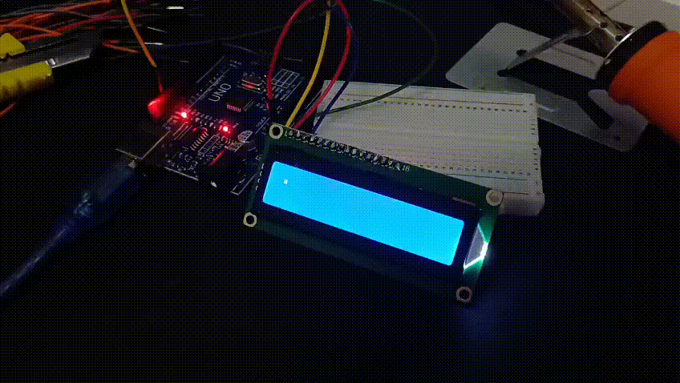

# arduinoLyrics 

Show song lyrics, line by line, on a 16x2 LCD screen using an Arduino Uno.

## What you need

- An Arduino Uno (or any compatible board)
- A 16x2 LCD screen (easier if you have a IC2 module soldered to it, less wires)
- A few jumper wires
- The Arduino IDE installed on your computer

## How to run it

1. Wire the LCD to your Arduino (check the diagram in the code if you're not sure).
2. Open the project in the Arduino IDE.
3. Pick a song from the `songs` folder, or write your own (see below).
4. Choose your board and port, then upload the sketch to your board.
5. The lyrics wil scroll after the 3 dots appear 

> [!WARNING]
> Right now the song doesnt automatically play with the lyrics and youll have to time it yourself!!
> different songs have different timings but i try for the most part to time them on the second dot

## Adding your own song

This project only gets more fun with more songs, so contributions are very welcome. If you want to add one:

1. Create a new artist folder inside `songs` if one doesnt exist already.
2. Create another folder with the song title and then the .ino file inside it (this is because the .ino file needs its own separate folder)
2. Follow the same format as the songs already there, you only need to change what comes after the last '.' and clear
> [!TIP]
> lcd.print('yourlyric'), lcd.clear, delay(miliseconds), lcd.setCursor(set location for the text)

> [!IMPORTANT]
> Please try to time the song properly, i dont mind if the timing isnt 10000% perfect, just try your best

3. Open a pull request.

## Contributing

PRs and issues are always welcome. This is just a small personal project/library for songs, but the more people jump in with their own songs, the better it gets.